# Creating an Azure IoT Central Application Hands-on Lab

|Author|[Dave Glover](https://developer.microsoft.com/en-us/advocates/dave-glover), Microsoft Cloud Developer Advocate |
|----|---|
|Documentation|[README](https://github.com/gloveboxes/Creating-an-Azure-IoT-Central-Application-Hands-on-Lab/blob/master/README.md)|
|Platform|[Azure IoT Central](https://docs.microsoft.com/en-us/azure/iot-central/?WT.mc_id=article-github-dglover), [Raspberry Pi Simulator](https://azure-samples.github.io/raspberry-pi-web-simulator/)|
|Video Training|[What is Azure IoT Central](https://docs.microsoft.com/en-us/azure/iot-central/overview-iot-central/?WT.mc_id=article-github-dglover)|
|Screencasts|[How to create the Azure IoT Central Application](https://youtu.be/D26rJmHyZcA)|
|Date|As at Nov 2018|

## Step 1: Create New IoT Central Application

Watch this 5-minute [screencast](https://youtu.be/D26rJmHyZcA) on how to create the Azure IoT Central Application to chart telemetry and send commands to your Particle Photon.

To summarize the screencast:

1. Create an Azure IoT Central application. Hold down the **control key** and click [https://azure.microsoft.com/en-au/services/iot-central](https://azure.microsoft.com/en-au/services/iot-central). Then click **Get Started**

    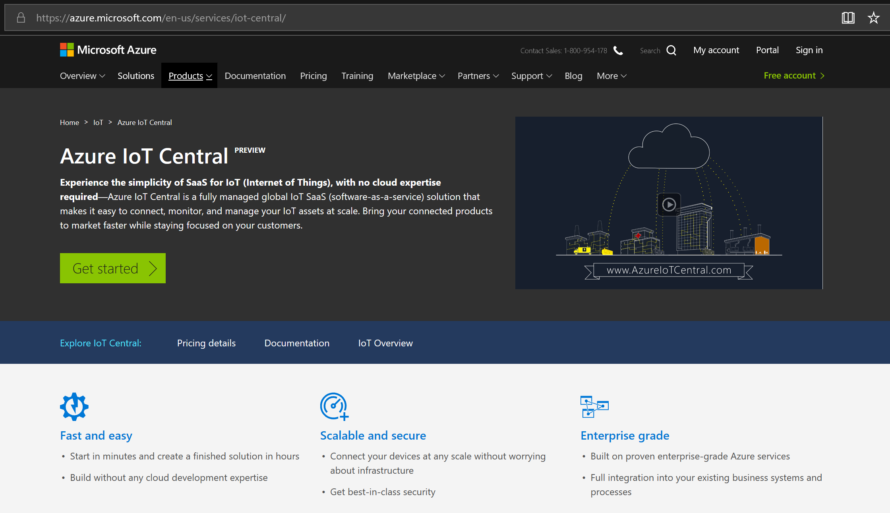

    Next, you'll need to sign with your Microsoft account. If you don't have one, you can create one for free using the **Create one!** link.

    

2. Once you are signed in, click the **New Application** button.

    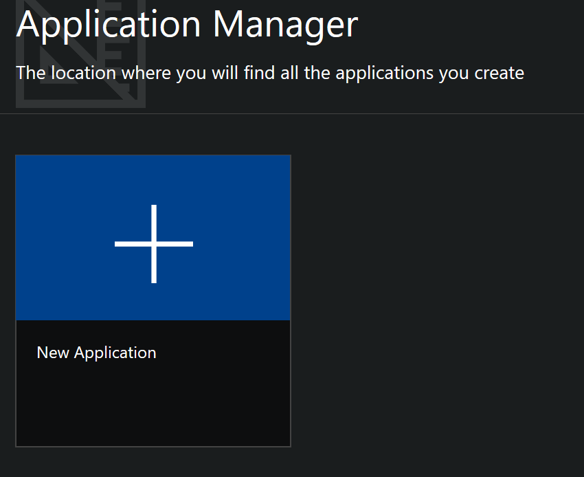

3. Select **Trial**, **Custom Application**, type your application name. Then click **Create**

    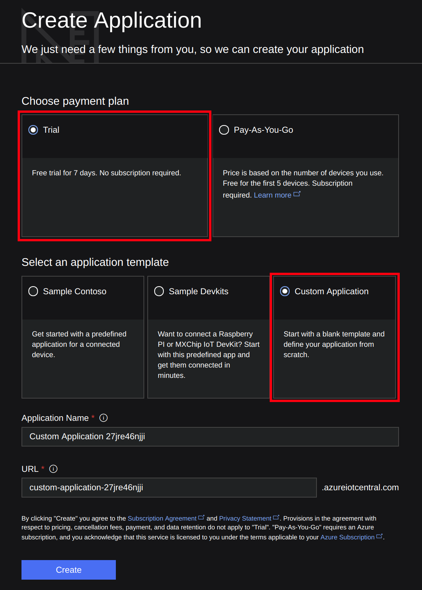

4. Click **Create Device Templates**, name your template, for example, "Raspberry". Then click **Create**

    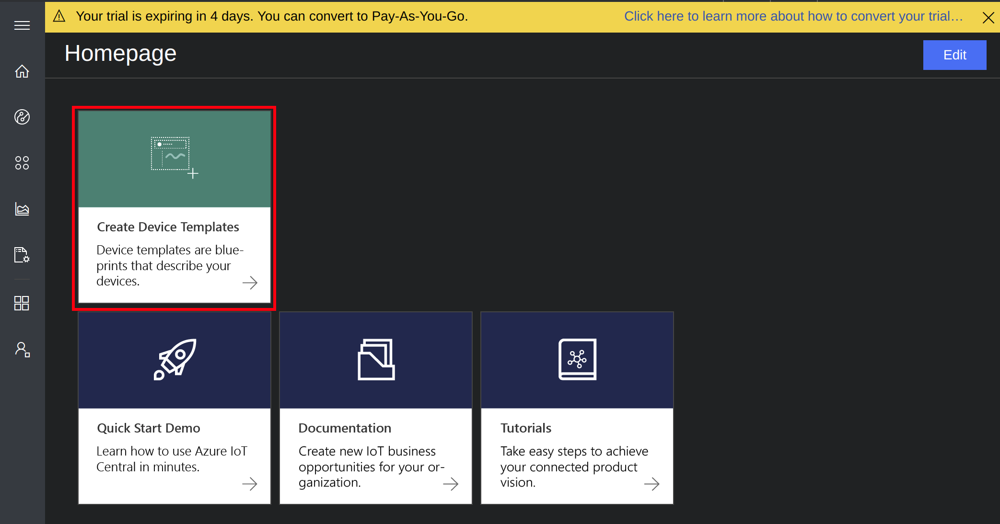

5. Edit the Template, add **Measurements** for **Temperature**, **Humidity**, and **Pressure** telemetry. You need to click **Save** after each measurement is defined.

    |Display Name| Field name     | Units  | Minimum | Maximum | Decimals |
    |------------| -------------- | ------ | ------- | ------- | -------- |
    |Humidity    | Humidity       | %      | 0       | 100     | 0        |
    |Temperature | Celcius (**Note incorrect spelling**) | degC    | -10   | 60  | 0  |
    |Pressure    | Pressure       | hPa    | 800     | 1260    | 0        |

    

    Then click **Done**.

6. Click **Device Explorer** on the sidebar menu, select the template you created. Then add a **Real Device**

    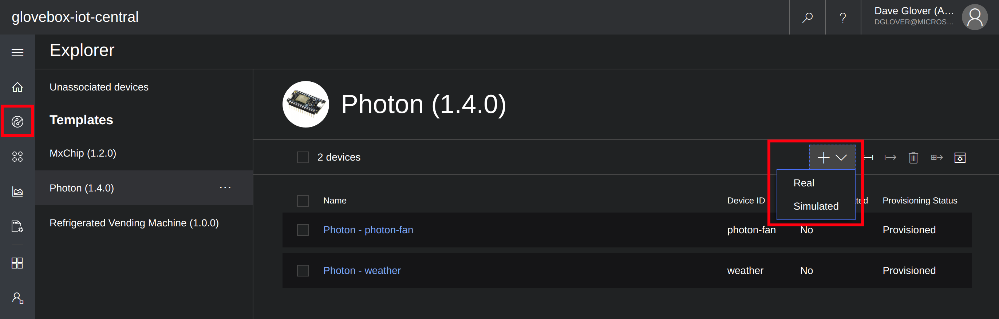

7. When you have created your real device click the **Connect** button in the top right-hand corner of the screen to display the device credentials.

    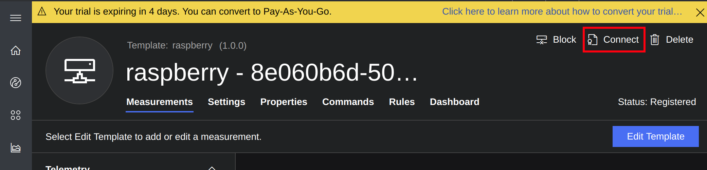

    You will need these credentials for the next step.

    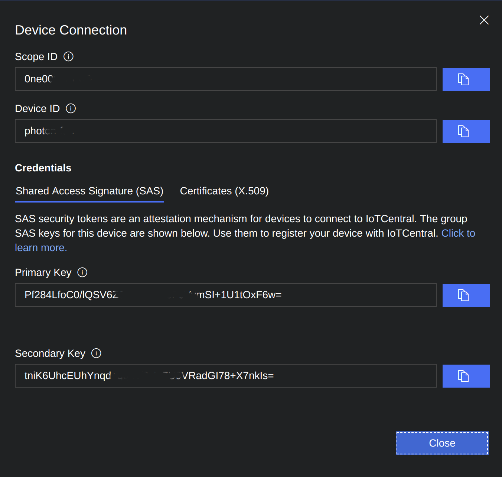

8. Generate an IoT Central Device Connection String

   Hold the control key down and click the following link [Connection String Generator](https://dpsgen.z8.web.core.windows.net/) to open in a new tab.

    Copy and paste the "Scope Id", "Device Id", and the "Primary Key" from the Azure IoT Central Device Connection panel to the Connection String Generator page and click "Get Connection String".

    

    Copy the generated connection string to the clipboard as you will need it for the next step.

## Step 2: Setup the Raspberry Pi Simulator

We will be using a Raspberry Pi simulator with our IoT Central application. The simulator will stream Temperature, Humidity, and Pressure telemetry to our Azure IoT Central application.

1. Hold the **control key** down and click [Start Raspberry Pi Simulator](https://azure-samples.github.io/raspberry-pi-web-simulator/#Getstarted) to open in a new browser tab.

    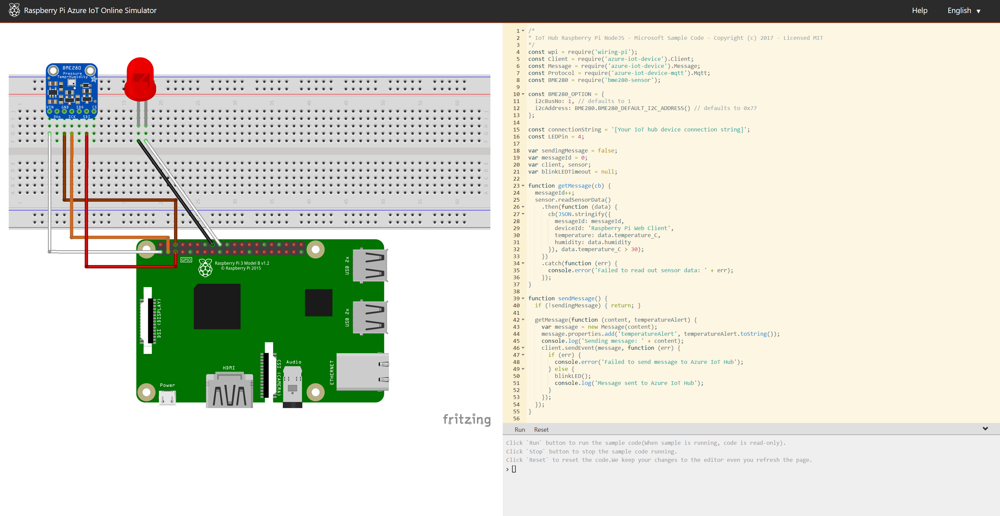

2. Click **Next**, **Next**, **Got it**.

3. Update the **Connection String** in the simulator

    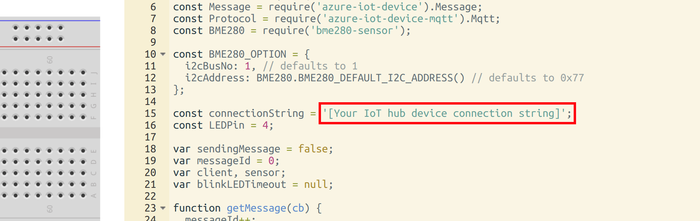

4. Delete the text that reads **[Your IoT hub device connection string]**. Be careful not to delete the single speech marks and the trailing semicolon.

5. Paste in the **Connection String** you generated.

   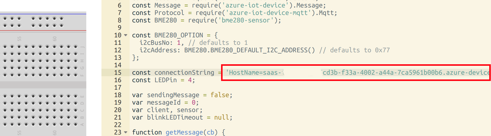

6. Next, run the simulator by clicking on the **Run** button. The simulator will start to send telemetry to the Azure IoT Central Application you created.

    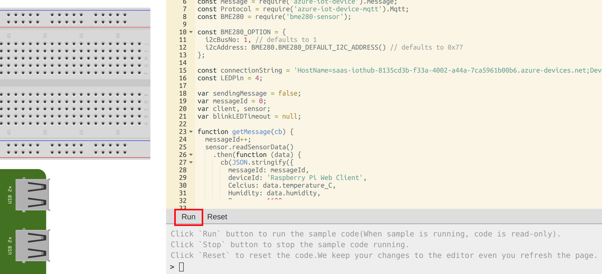

7. Switch back to the IoT Central Application tab in your browser and start exploring the charting options.

    Click the **Device Explorer** icon, then select the device you create. Try out various chart options and tune the telemetry values.

    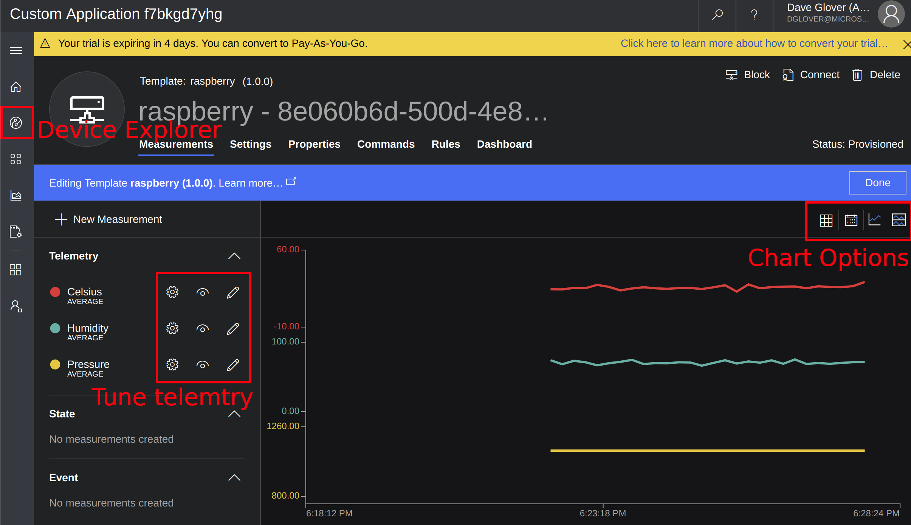

## Next Steps

Congratulations! You've successfully connected a device into your own Azure IoT Central Application. Nice. However, we've only just begun exploring the capability of this powerful software.

But what to do now? Check out the [IoT Central documentation](https://docs.microsoft.com/en-us/azure/iot-central/overview-iot-central/?WT.mc_id=article-github-dglover) to dive deeper into all of the rich features of IoT Central.

Or have a look at some of these great tutorials:

- [Create an Azure IoT Central application](https://docs.microsoft.com/en-au/azure/iot-central/howto-create-application/?WT.mc_id=article-github-dglover)
- [Administer your IoT Central application](https://docs.microsoft.com/en-au/azure/iot-central/howto-administer/?WT.mc_id=article-github-dglover)
- [Set up a device template](https://docs.microsoft.com/en-au/azure/iot-central/howto-set-up-template/?WT.mc_id=article-github-dglover)
- [Create a new device template version](https://docs.microsoft.com/en-au/azure/iot-central/howto-version-devicetemplate/?WT.mc_id=article-github-dglover)